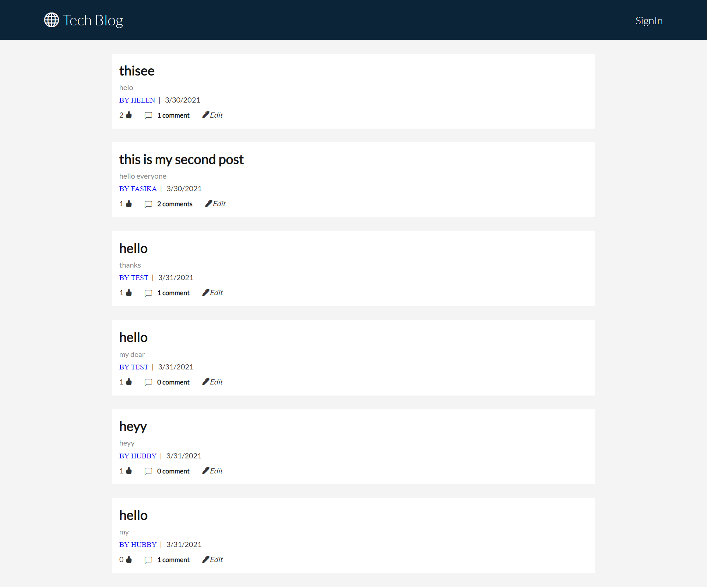

# Tech Blog

## Description

This tech-blog application is designed for connecting peoples and enable them to share their ideas about technology news and other related topics.

## Table of Content

- [Installation](#Installation)
- [Usage](#Usage)
- [Licence](#Licence)
- [Features](#Features)
- [contributing](#contributing)
- [Tests](#Tests)

## Installation

`npm install`

## Usage
- Go to https://tech-blog-post.herokuapp.com/ and open the application 
- Click Signin to create an account, insert your name and your password
- You can like ,comment and post your blog post.

## Licence

This Licence belongs to Apache

## Features
- Mobile responsive
- A user are not able to edit a post if it is not belongs to him/her.
- A user is not allowed to like one post more than once.

## Contributing

Pull requests are welcome. For major changes, please open an issue first to discuss what you would like to change. Please make sure to update the code as appropriate.

## Tests

`npm run test`

## Questions

If you have any question about the repo, open an issue or contact me directly at [fasikaWalle](https://github.com/fasikaWalle/)

If you want to reach me for further questions please contact me through fasikabini12@gmail.com
